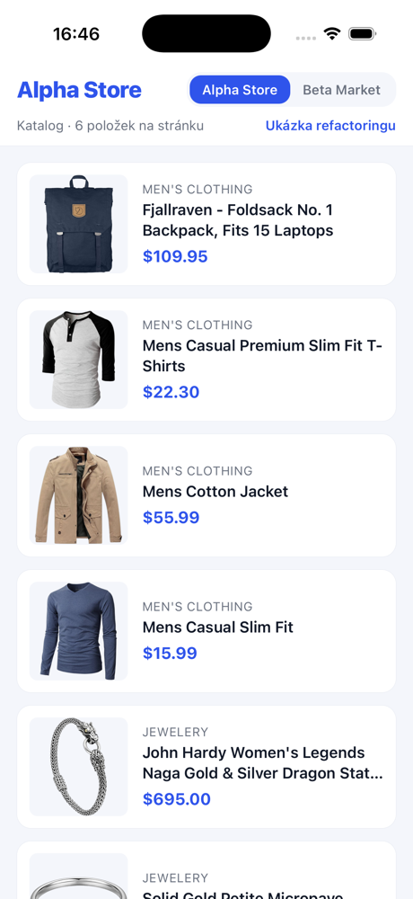
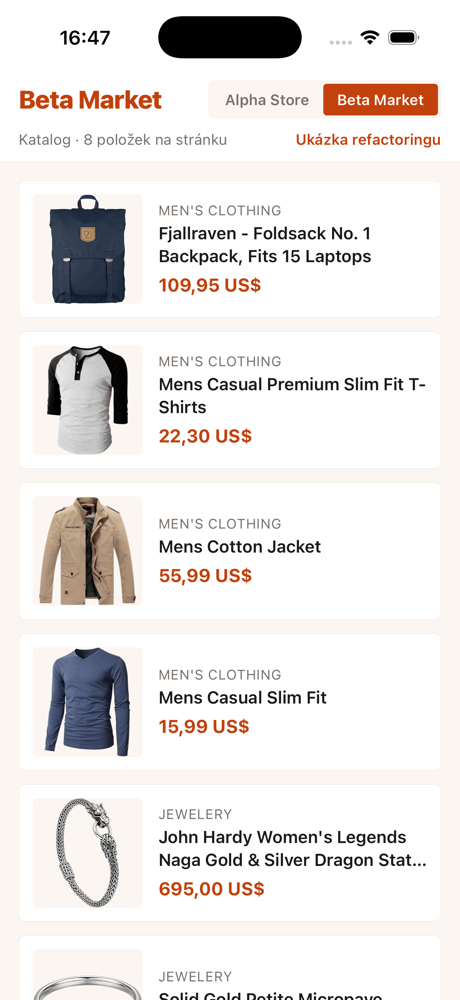
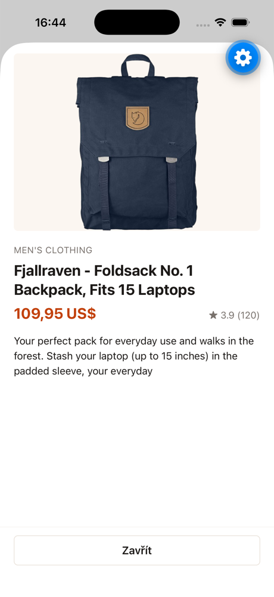
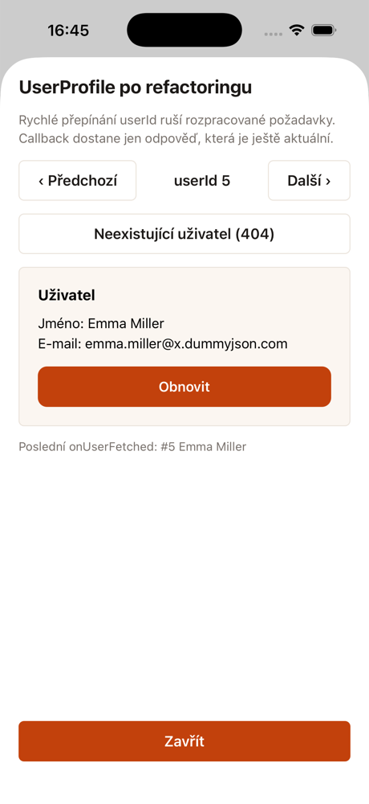
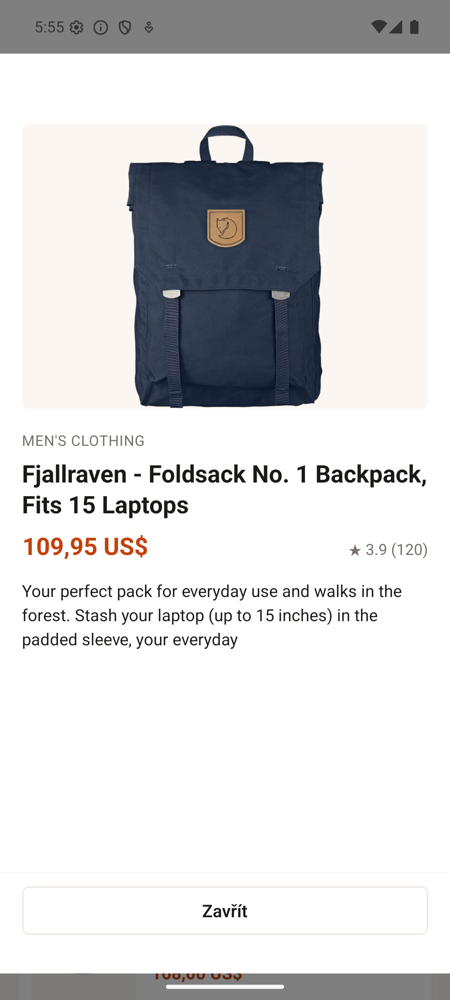

# Product List

Expo aplikace nad Fake Store API. Seznam produktů se stránkováním, pull-to-refresh
a chybovými stavy, přepínání dvou brandů a refactoring komponenty `UserProfile` ze zadání.

<p>
  
  
  
  
  
</p>

## Spuštění

```
npm install
npx expo start
```

Pak QR kód v Expo Go (SDK 57), nebo `npx expo start --ios` / `--android`. Mám Node 22.

Testy `npm test`, typy `npm run typecheck`, lint `npm run lint`.

## Struktura

```
src/
  api/            ApiError, obal nad fetch (timeout, zrušení, validace), adaptér na Fake Store
  brands/         konfigurace brandů (alpha, beta), registr, BrandProvider
  features/
    products/     reducer, hook useProducts, obrazovka, karta, patička, detail
    user-profile/ ukázka refaktorované komponenty
  refactoring/    legacy.tsx (beze změny, vyřazený z tsc a lintu) a refactored.tsx
  components/     Button, BrandSwitcher, InlineNotice
  theme/          useThemedStyles
```

Testy jsou v `__tests__` vedle kódu.

## Jak to funguje

### Seznam

`BrandProvider` drží aktivní brand. Z jeho konfigurace se vyrobí API klient a `useProducts(api)`
z něj načítá stránky. Stav seznamu je v `productsReducer.ts`: union `loading` / `error` /
`ready` a jeden `request`, který zrovna běží. Reducer rozhoduje, jestli se smí načíst další
stránka, že refresh zahodí rozpracované dotahování, a že odpověď na zrušený request se
ignoruje. Hook jen spouští requesty a v cleanupu je ruší přes `AbortController`.

Po přepnutí brandu se vymění klient a stav se resetuje ještě v renderu, aby se nesmíchaly
produkty dvou brandů.

Stavy: první načítání, chyba s retry, pull-to-refresh (seznam zůstává), dotahování další
stránky s indikátorem v patičce, chyba dotahování s retry v patičce, konec katalogu. Když
selže refresh, seznam zůstane a chyba je jako proužek nad ním.

### Stránkování

Fake Store umí `?limit=N`, ale `offset` ani `page` ne, ignoruje je (zkoušel jsem). Adaptér
tedy pro stránku `p` požádá o `limit = (p + 1) * pageSize` a vezme si jen konec. Každá stránka
je pořád jeden request, takže stavy dotahování jsou opravdové. Nevýhoda je payload rostoucí
se stránkou, u 20 produktů to nevadí. S opravdovým API by se měnila jen tahle jedna funkce.
Při spojování stránek se deduplikuje podle `id`.

### Výkon seznamu

Karta má pevnou výšku, takže jde použít `getItemLayout`; písmo v kartě proto škáluje
nejvýš 1,2x, jinak by se při velkém systémovém písmu ořízlo. `ProductCard` je v `React.memo`
a dostává jeden stabilní `onPress(id)`. Callbacky z hooku se nemění, `keyExtractor`
a `getItemLayout` jsou mimo komponentu. `windowSize` 7 místo výchozích 21, tedy tři
obrazovky na každou stranu, `initialNumToRender` 8 (o něco víc než jedna obrazovka),
`maxToRenderPerBatch` 6 a `updateCellsBatchingPeriod` 50 ms. `removeClippedSubviews` jen
na Androidu. Obrázky přes `expo-image`. Styly závislé na theme
jsou v `useMemo`. Odpověď z API se validuje, do stavu jde jen to, co UI používá.

### Brandy

Vše, čím se brandy liší, je v `src/brands/alpha.ts` a `beta.ts`: barvy, zaoblení, `baseUrl`,
velikost stránky, timeout a locale pro cenu. Objekty jsou `satisfies BrandConfig`, registr
je `Record<BrandId, BrandConfig>`, chybějící hodnota neprojde typecheckem. Komponenty berou
hodnoty přes `useBrand()`, natvrdo v nich žádná barva není.

Přepínač v hlavičce je obyčejný stav v provideru. V ostrém white-label buildu by tam byla
hodnota z buildu a přepínač by nebyl.

### Refactoring

Co bylo v `legacy.tsx` špatně: efekt s `[]` nereaguje na změnu `userId`; requesty se neruší,
takže pomalejší odpověď na starý `userId` přepíše novější a zavolá `onUserFetched`;
`res.json()` bez kontroly `ok` a bez `catch`; netypované props a `any` z JSONu; fetch, stav
a vzhled v jedné funkci.

`refactored.tsx` to rozděluje na `fetchUser`, hook `useUser` a view `UserProfileView`.
Výchozí export `UserProfile` má stejné props jako originál. V hooku má každý request klíč
`userId:generation`, uloží se jen poslední dokončený a loading se z toho odvodí, takže se
nemůže rozejít se skutečností. Cleanup efektu ruší request při změně `userId` i při unmountu,
callback jde přes ref. V aplikaci je to pod "Ukázka refactoringu".

## Kdyby to bylo naostro

**Cache a offline.** TanStack Query (`useInfiniteQuery` je přesně tenhle seznam)
s `persistQueryClient` nad MMKV, brand v query key. Obrázky si cachuje `expo-image`. Plný
offline znamená i lokální zdroj pravdy (SQLite nebo WatermelonDB), frontu odložených akcí
s idempotentními klíči a řešení konfliktů. NetInfo bych použil jen pro UX.

**Desítky brandů.** Brand vybírat při buildu: `app.config.ts` čte `BRAND` z prostředí
a nastaví název, bundle id, ikonu, splash a `extra` pro API. Na každý brand profil v EAS,
kanál pro EAS Update a řádek v CI. V repu složka `brands/<id>/` s tokeny v JSON, assety a API
konfigurací, kód importuje jen aktivní brand. Tokeny sémantické (`primary`, `surface`), ne per
komponenta. Sdílené UI ve vlastním balíčku, aplikace brandu je jen slupka. Feature flagy
a texty z remote configu s brandem v klíči.

**Tisíce položek s dynamickými výškami.** Bez `getItemLayout` FlatList při skoku daleko
měří naslepo. Vzal bych FlashList (`estimatedItemSize`, `getItemType`) nebo Legend List,
recyklují buňky. Bez ohledu na knihovnu: cursor ze serveru, normalizovaná data, žádné inline
objekty v props řádků, obrázky s předem známým poměrem stran a `windowSize` změřený
profilerem. Kde to jde, spočítat výšku dopředu z délky textu a `getItemLayout` vrátit.

## Co jsem vynechal

Navigační knihovnu (jedna obrazovka a dva modaly), i18n, tmavý režim, řazení a filtry,
error boundary, E2E testy. Vyzkoušeno v Expo Go na iOS simulátoru i Android emulátoru,
včetně chybových stavů s vypnutou sítí.
